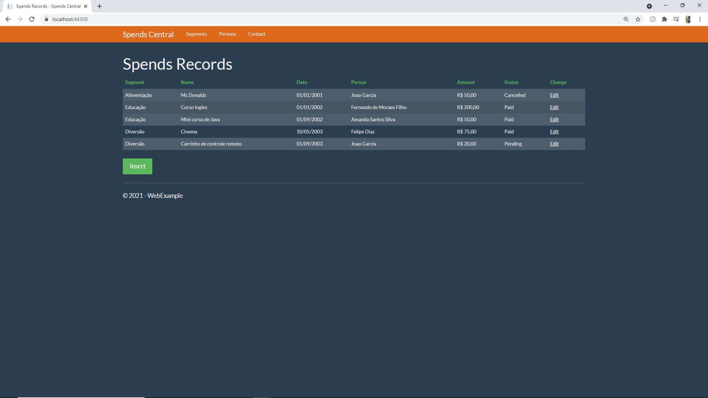
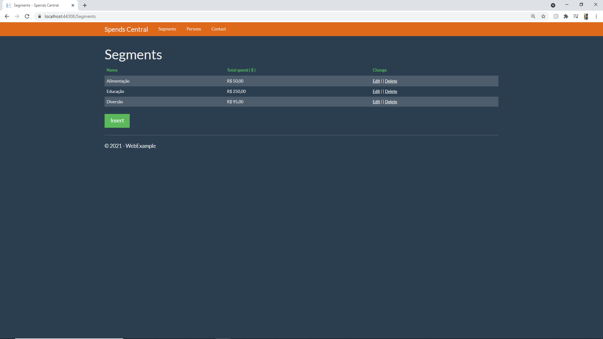
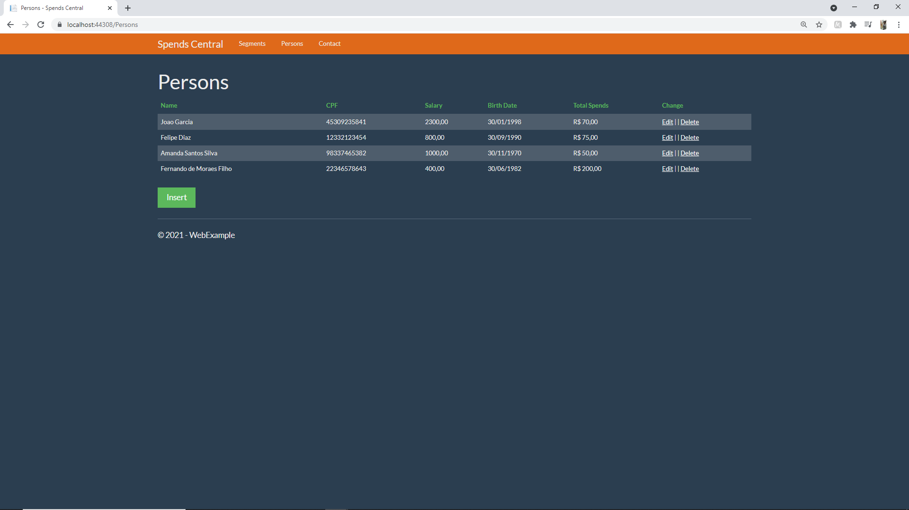
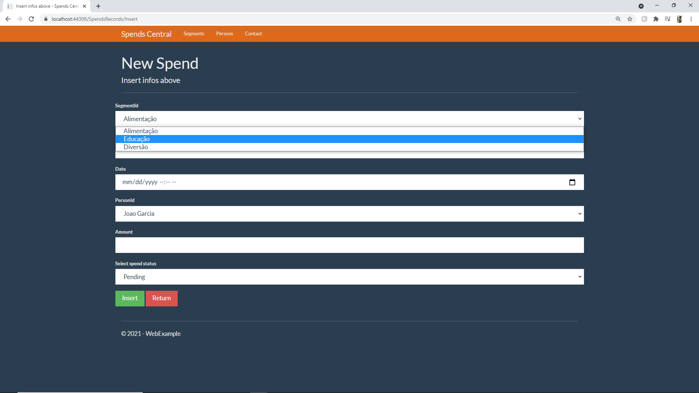

# C# WEB EXAMPLE

This web asp .net MVC project was coded during a week of studies of C#. It was used to better learn how MVC works, as well as how we use layers in coding to segregate funcionalities.
### Languages 
* C#, HTML
### To test you'll need:
* Use .NET Core 2.1
* MySQL Provider
* Git clone this and execute "Update-Database" command in your VS Package Manager. (To auto create the DB you need).
* Run the site to interact with content and seed your DB.

### Description
This project controls Spends from diferents Persons, separeted by Segments, like Education, Fun etc...

* The entities are : Persons, Segments and SpendRecords.
* Each entities has it owns atributes.
* You can have a resume of all spends by segment or by person in his page.
* You can edit or remove any of pre-seeded data, as well as add any of your interest.
* All data manipulated in Views are saved to you DB, in respective table.

Some of the pages..

### View

### Insert

### Delete confirmation

### Edit

#### By João Garcia
